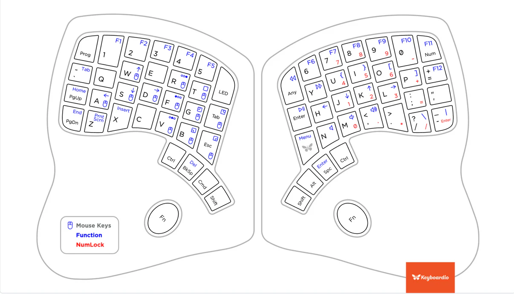
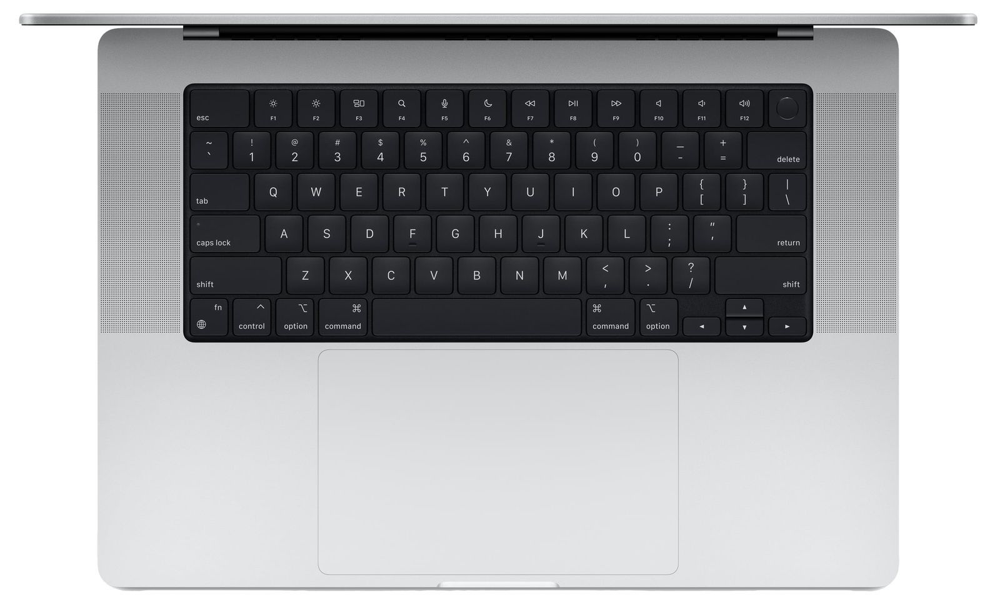
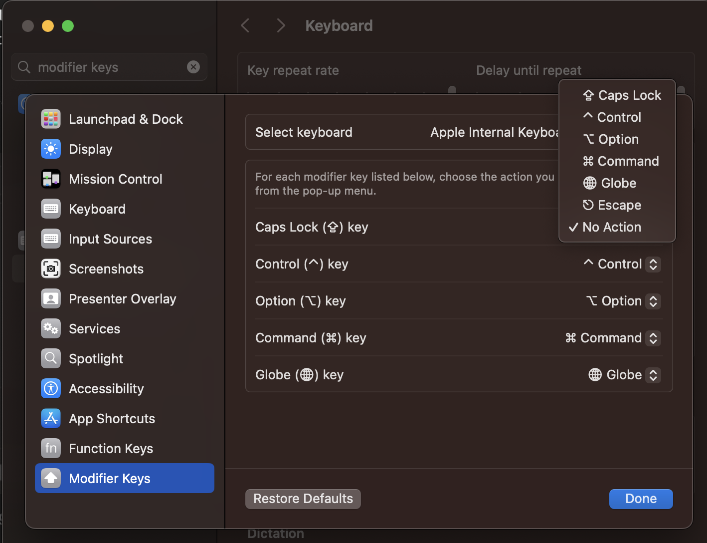
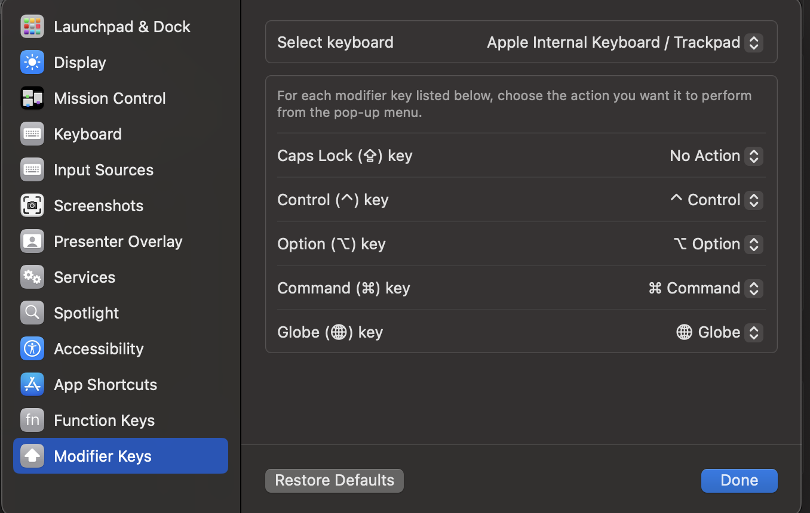

I love making improvements to my work environment. I tweak my tools to reduce the friction between me and my code. I thought I’d share one of my favorites adjustments when using a MacBook Pro, but first I want to dig into what inspired the change.

  

## Inspiration

When I got a Keyboarding Model 01 (and then later Model 100), the first thing that I did was explore changing the keyboard layout to suit my needs. The default position of the tab key was on the home row, but on the opposite side of the keyboard than my left hand is used to reaching for it.

(Image source: [https://shop.keyboard.io/products/model-100](https://shop.keyboard.io/products/model-100))

That position didn’t feel very natural to me, so I modified the layout to move the key to “correct” side of the keyboard. I found the idea of having it on the home row intriguing, though, so I tried out leaving it on the left side of the home row.

After trying it out for a bit, I never went back. It just felt so natural having the tab key there.

I also use the accent gave/tilde key a lot (\`/~), especially when writing code snippets in Markdown syntax. And my muscle memory is used to having that key right above the tab key. That’s right were the key is found on the default Keyboardio Model 100 layout, so I left it alone.

  

## Typing on the MacBook Pro Keyboard

Most of the time that I’m using my MacBook Pro, it’s hooked up to a dock so that I can type with the Keyboardio Model 100, so I really got used to having the tab and accent grave keys in that position.

This created some issues whenever I would switch to using my MacBook Pro in a typical laptop set up. Like, with it on my lap. Every time I would reach for the tab key, I would accidentally turn on caps lock instead, because on the MacBook Pro, the caps lock key is to the left of the “a” on the home row.

(Image source: [https://www.macrumors.com/roundup/macbook-pro/](https://www.macrumors.com/roundup/macbook-pro/))

After about the 100th time of accidentally turning on caps lock, I went looking to see if there was a way to change the caps lock key to act like tab instead.

macOS does provide some options for changing the behavior of the caps lock key, but acting like a tab key is not one of the options.

(Image source: screenshot)

That didn’t really work for me, so I kept looking, and I eventually found something that not only worked, but worked really well, [Karabiner-Elements](https://karabiner-elements.pqrs.org/).

  

## Enter Karabiner-Elements

Karabiner-Elements is an open source application that allows you to completely take control of the way keyboards behave in macOS. I’m honestly only using about 5% of its functionality. And even then I find it amazing. I like the program so much, that I [send the maintainer some money](https://karabiner-elements.pqrs.org/docs/pricing/) from time to time, and I encourage you to do the same if Karabiner-Elements ends up working well for you.

With Karabiner-Elements, I was able to change the behavior of the the built in keyboard on the MacBook Pro without affecting the behavior of any other connected keyboards. And while I went hunting for a solution that would make the caps lock key behave like a tab key, I discovered that Karabiner-Elements was also able to change the default tab key to behave like an accent grave, thus preserving the muscle memory that I have for where accent grave is located in relation to the tab key.

(Image source: screenshot)

  

## Interactions with Parallels Desktop

I recently started heavily using a Windows VM via [Parallels Desktop](https://www.parallels.com/), and I was pleasantly surprised to discover that after setting up Karabiner-Elements, the changes that I made to tab and accent grave also take effect when I’m typing inside of the VM.

I was surprised by this. Mostly because I type in Dvorak, and when I switch between Dovorak and Qwerty via macOS, it doesn’t change the keyboard layout that’s used by the VM in Windows. This means that I also have to change the keyboard layout in Windows when I want to switch back and forth. I thought that the changes that Karabiner-Elements is making would be similarly affected.

I was expecting to have to find a Windows-specific solution, such as the [keyboard manager that’s built into PowerToys](https://learn.microsoft.com/en-us/windows/powertoys/keyboard-manager), but now I don’t have to. I’m guessing that Karabiner-Elements is making lower level changes to the keyboard than is made by a simple keyboard layout adjustment.

  

## Potential Gotcha

After using Karabiner-Elements in this configuration for a few years, I did discover that sometimes caps lock would get activated when I attempted to type a tab character. This was really frustrating, because it really only happened for one keypress. All of the keypresses after that would insert a tab character. I would have to modify Karabiner-Elements so that it wasn’t changing the behavior of the caps lock key anymore, and then use the key to toggle caps lock off.

I was never quite able to replicate the issue consistently enough to feel comfortable filling a bug report. Instead, I’ve worked around it by configuring macOS to change the behavior of the caps lock key to do nothing. That way if Karabiner-Elements doesn’t intercept the keypress for some reason, I don’t accidentally activate caps lock.

(Image source: screenshot)

  

## A Must Have Configuration

Any time I set up a new MacBook Pro, Karabiner-Elements is one of the first things that I install and configure. If you’re like me and you enjoy tinkering with the behavior of your input devices, then I strongly suggest you give it a try.
